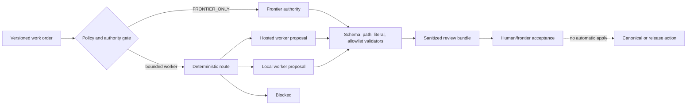

# Scientific LLM Orchestrator

**Evidence-gated routing of frontier, hosted-open, and local language models
for scientific software engineering.**

> Scientific agents should not spend frontier-model tokens on every file scan,
> format repair, test candidate, or visual check. This project routes bounded
> work to candidate hosted-open or local workers, validates outputs
> deterministically, and keeps
> scientific judgment with a frontier reviewer.

This is an **Apache-2.0 research prototype**, not a production agent and not a
claim that local models are superior to frontier models. The public MVP records
bounded proposals and deterministic receipts; it never applies generated code
automatically.

## What it solves

The package makes a routing decision among `frontier`, `hosted_worker`,
`local_worker`, and `blocked` for four fixed baseline architectures. It keeps
scientific, citation, security, canonical-source, and release authority with
the frontier reviewer. Repository-owned checks enforce schemas, protected
literals, path scope, and an allowlisted validation set.

Why use a local worker when hosted agents are inexpensive? Bounded, repetitive,
public or private-but-authorized work may be cheaper to keep local, easier to
repeat, or unsuitable for a hosted provider. That is a research question here,
not a conclusion: provider terms, quality, privacy, latency, energy, fallback,
and hosted-token displacement must be measured separately.

## Five-minute credential-free dry run

Python 3.10+ and the standard library are sufficient at runtime. From this
standalone repository root, run:

```text
python scripts/run_static_qa.py --root .
python scripts/run_synthetic_benchmark.py --root .
```

Expected output includes:

```text
synthetic_benchmark: PASS cases=32 architectures=4 evidence=observed-deterministic actual_model=not-run
```

No credentials, network calls, provider SDKs, model weights, or actual-model
results are used. To create a sanitized review receipt, run
`python scripts/build_review_bundle.py --root .`; it emits
`observed-mock-runtime`, not real-model evidence. The default
`review-bundle.json` is a local generated artifact: `.gitignore` and the
publication scanner explicitly exclude it, so generating it does not make the
publication manifest stale. Use `--output <explicit-path>` when a bundle is
intended for separate review and publication handling.

## Architecture



The route is a proposal lane. A worker cannot decide scientific validity,
citations, security severity, canonical-source acceptance, or release status.
The first release has no automatic code application.

## Evidence status

The exact allowed labels are `observed-real-model`, `observed-deterministic`,
`observed-mock-runtime`, `vendor-reported`, `inferred`, `proposed`, and
`not-run`. The included synthetic benchmark is `observed-deterministic`.
Actual-model benchmark evidence is **not-run**. Synthetic passes are harness
qualification only; they are not scientific validation, model quality, or
performance evidence.

## Repository map

- `src/scientific_llm_orchestrator/` — versioned contracts, routing, validators,
  metrics, and dry-run adapter.
- `schemas/` and `configs/` — machine-readable public contracts and examples.
- `benchmarks/` — balanced public-safe coding, data/mechanics, visual/figure,
  and parametric-CAD fixtures with expected results.
- `scripts/` — offline QA, benchmark, review-bundle, and publication scan.
- `setup.py` — minimal offline-install compatibility entry point used only by
  the fresh-clone smoke when the optional `wheel` package is unavailable.
- `src/scientific_llm_orchestrator/validators/schema_subset.py` — standard-library validator for the exact
  schema subset used here; it is not a full JSON Schema implementation.
- `docs/` — authority, privacy, methodology, limitations, qualification, and
  roadmap boundaries.
- `publication-manifest.json` — deterministic relative-path SHA-256 manifest;
  the manifest excludes its own entry and the default generated
  `review-bundle.json`, and requires semantic human review.

## Limitations and privacy

Only public or public-synthetic examples belong in this tree. Do not send
private research, unpublished figures, raw data, credentials, local paths, or
provider secrets to a future adapter. No provider terms have been verified by
this MVP, no API was called, and no price/quota claim is made. Read
[`docs/limitations.md`](docs/limitations.md) and
[`docs/privacy-model.md`](docs/privacy-model.md) before extending it.

## Benchmark methodology

See [`benchmarks/README.md`](benchmarks/README.md) and
[`docs/benchmark-methodology.md`](docs/benchmark-methodology.md). The suite
checks reproducible fixture expectations and route contracts across all four
baseline architectures. It does not execute proposed code or infer a root
cause from a synthetic log.

## Contributing and citation

Contributions must preserve the authority boundary, evidence labels, license,
and publication scan. See [`CONTRIBUTING.md`](CONTRIBUTING.md) and
[`SECURITY.md`](SECURITY.md). Citation metadata is in [`CITATION.cff`](CITATION.cff).

## Research-prototype status

This project is intentionally small and incomplete. The public release gate
requires deterministic QA followed by separate semantic review. Promotion,
provider qualification, research-credit applications, repository creation,
publication, and release are **not-run / not-submitted / not-published** by
this source-tree build.
