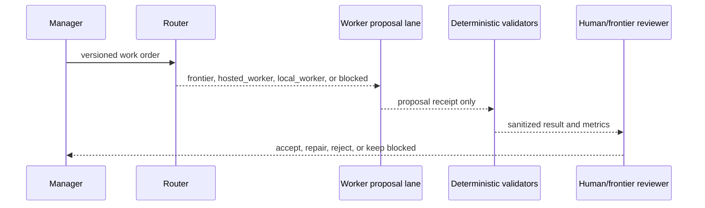

# Architecture

The MVP has five explicit layers:

1. A versioned `WorkOrder` describes a bounded public or public-synthetic task.
2. The router selects one of the four exact baseline architectures and a
   deterministic route.
3. Worker routes are proposal-only; the `DryRunAdapter` makes no provider call.
4. Repository-owned validators check schemas, path scope, protected literals,
   and allowlisted validation IDs.
5. A sanitized result or review bundle is handed to a human/frontier reviewer.

The repository does not contain a provider SDK, model runtime, automatic patch
application, or release action.
