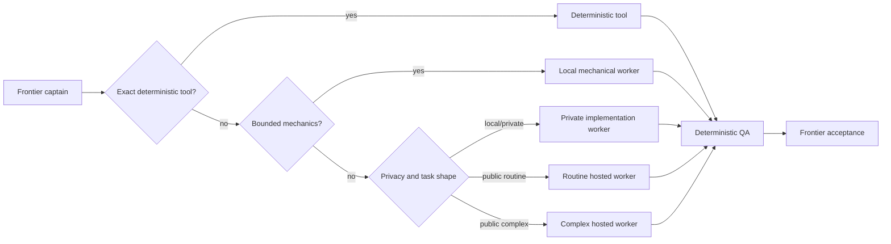

# Captain portfolio

The Captain portfolio is a provider-neutral extension of the existing public
router. Its aim is to reduce expensive frontier implementation output without
delegating final judgment.

The public repository defines roles rather than products. A private deployment
may bind a role to an available model, but credentials, account details, actual
quota state, prices, provider-specific model names, raw prompts, raw responses,
and local paths do not belong here.

## Selection rules

1. Exact deterministic tools take precedence over every model.
2. A bounded local worker may handle mechanical work when a deterministic
   evaluator exists.
3. Local/private work stays with a private implementation worker or the
   frontier captain.
4. Public or public-synthetic routine and complex work may use separate hosted
   implementation roles only when the route, privacy, role-discovery, usage,
   and evaluator preflight gates all pass.
5. A failed hosted invocation is not silently retried through another provider.
6. Every worker result is a proposal. `automatic_apply=false` and frontier
   acceptance remain invariant.

## Evidence boundary

The included tests are `observed-deterministic`. Provider qualification and
actual-model performance are `not-run` in this repository. Runtime completion,
token counts, or a result-format pass must not be interpreted as quality
equivalence.

An implementation role should remain provisional until it has at least 20
independent QA receipts across three stable task families and has been compared
on verified-pass rate and frontier review burden. Those thresholds are an
example governance gate, not a performance result.
